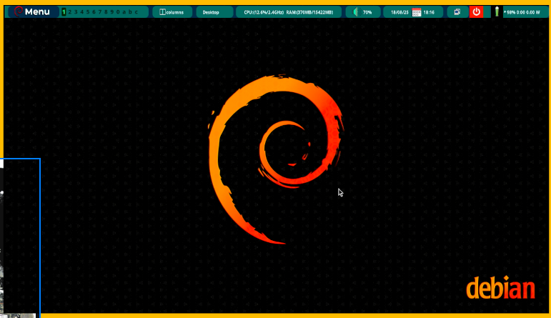

# 🚀 DWM-Qtile Sistema de Desarrollo Integrado

## 📋 Descripción

**Sistema de desarrollo completamente integrado** que combina DWM/Qtile con un entorno de desarrollo containerizado profesional para **Debian Trixie**. Este proyecto ha evolucionado de una configuración básica a un **sistema completo de desarrollo** con scripts coordinados.

### ✨ Sistema Integrado v2.0

Todos los scripts han sido mejorados para trabajar de manera coordinada, proporcionando:

- **🔧 Configuración unificada** con archivos centralizados (`~/.dev_config`)
- **📊 Sistema de logging integrado** para monitoreo completo (`~/.dev_logger`)
- **🐳 Contenedores optimizados** para desarrollo multi-lenguaje
- **⚙️ Gestión automática** de servicios y dependencias
- **🛠️ Herramientas avanzadas** con funciones inteligentes
- **🎮 Script maestro coordinador** (`master-dev.sh`)

## 🎯 Características Principales

### 🔧 Coordinación Total
- **Scripts coordinados** que se comunican entre sí
- **Instalación paso a paso** con verificación automática
- **Reparación automática** de problemas del sistema
- **Monitoreo en tiempo real** de recursos y servicios

### 🐳 Entornos de Desarrollo Completos
- **Python**: Django, Flask, FastAPI + PostgreSQL, MongoDB, Redis
- **Node.js**: React, Next.js, Vue.js + herramientas modernas
- **Java**: Spring Boot + Maven/Gradle + OpenJDK 17+
- **Go**: Gin, Echo, Fiber + toolchain completo
- **Bases de datos**: Stack completo con interfaces web

### 🛠️ Herramientas Avanzadas
- **Creación inteligente** de proyectos con templates
- **VS Code Remote Containers** pre-configurado
- **Funciones de shell** personalizadas (`newpy`, `newnode`, `opencode`)
- **Gestión automática** de contenedores (`devup`, `devdown`, `devstatus`)

## 📚 Documentación del Sistema

| Documento | Propósito | Nivel | Recomendado |
|-----------|-----------|-------|-------------|
| **[`docs/SISTEMA_INTEGRADO.md`](./docs/SISTEMA_INTEGRADO.md)** | **📖 Guía principal del sistema integrado** | **Principal** | **⭐ START HERE** |
| [`ARQUITECTURA.md`](./ARQUITECTURA.md) | **🏗️ Arquitectura y estructura del proyecto** | **Técnico** | **Para desarrolladores** |
| [`docs/QUICKSTART.md`](./docs/QUICKSTART.md) | Instalación rápida en 5 minutos | Básico | Para empezar |
| [`docs/README_CONTAINERS.md`](./docs/README_CONTAINERS.md) | Guía completa de contenedores | Avanzado | Para comprender |
| [`docs/README_DEVELOPER.md`](./docs/README_DEVELOPER.md) | Adaptaciones DWM/Qtile específicas | Intermedio | Para personalizar |
| [`docs/TROUBLESHOOTING.md`](./docs/TROUBLESHOOTING.md) | Solución de problemas y debugging | Referencia | Para problemas |
| [`docs/INDEX.md`](./docs/INDEX.md) | Índice de toda la documentación | Navegación | Para navegar |

## 🎯 Instalación del Sistema Integrado

### ⚡ Instalación Rápida (Recomendada)
```bash
# Clonar el repositorio
git clone <este-repo>
cd dwm-qtile-system

# Instalación completa automatizada
./scripts/master-dev.sh install all

# Si requiere reinicio, continuar con:
./scripts/master-dev.sh install continue
```

### 📋 Instalación Paso a Paso
```bash
# Paso 1: Base del sistema
./scripts/master-dev.sh install base
# REINICIAR SESIÓN

# Paso 2: Herramientas de desarrollo
./scripts/master-dev.sh install tools

# Paso 3: Contenedores Docker
./scripts/master-dev.sh install containers

# Paso 4: Gestor de servicios
./scripts/master-dev.sh install manager
```

### 🔍 Verificación del Sistema
```bash
# Verificar instalación completa
./scripts/master-dev.sh check

# Ver estado completo
./scripts/master-dev.sh status

# Reparar problemas automáticamente
./scripts/master-dev.sh repair
```

## 🏗️ Arquitectura del Proyecto

El proyecto está organizado con una **arquitectura limpia y profesional**:

```
dwm-qtile-system/
├── 📖 README.md                           # Este archivo - Entrada principal
├── 🏗️ ARQUITECTURA.md                    # Documentación de la arquitectura
│
├── � docs/                              # Documentación completa
│   ├── SISTEMA_INTEGRADO.md              # Guía principal (⭐ PRINCIPAL)
│   ├── QUICKSTART.md                     # Instalación rápida
│   ├── INDEX.md                          # Navegación completa
│   └── ... (más documentación)
│
├── 🔧 scripts/                           # Scripts del sistema
│   ├── master-dev.sh                     # Script coordinador principal
│   ├── core/                            # Scripts principales integrados
│   └── legacy/                          # Scripts originales (archivados)
│
├── ⚙️ config/                            # Configuraciones del sistema
└── 🎨 assets/                            # Recursos (imágenes, etc.)
```

**📚 Para detalles completos**: [`ARQUITECTURA.md`](./ARQUITECTURA.md)

## 🚀 Scripts del Sistema Integrado

### Scripts Principales (Nueva Arquitectura Organizada)
| Script | Función | Integración |
|--------|---------|-------------|
| `scripts/master-dev.sh` | **Script maestro coordinador** | Controla todo el sistema |
| `scripts/core/01-install-developer.sh` | Instalación base con configuración integrada | ✅ Sistema unificado |
| `scripts/core/03-config-dev-tools.sh` | Configuración avanzada de herramientas | ✅ Logging integrado |
| `scripts/core/setup-dev-containers.sh` | Configuración de contenedores | ✅ Red coordinada |
| `scripts/core/dev-manager.sh` | Gestor de contenedores y servicios | ✅ Monitoreo integrado |

### Scripts Legacy (Archivados de Manera Segura)
```
scripts/legacy/01-install-full.sh          # Script original completo  
scripts/legacy/02-install-interactiva.sh   # Script original interactivo
```
*Estos scripts están archivados para referencia histórica*
```
dev-check                    # Verificación del sistema
dev-init                     # Inicialización de proyectos  
dev-setup-complete          # Verificación post-instalación
tools-check                 # Verificación de herramientas
update-dev-tools-integrated # Actualización coordinada
```

### Funciones de Shell Avanzadas (Auto-instaladas)
```bash
newpy myproject [tipo]       # Crear proyecto Python inteligente
newnode myapp [framework]    # Crear proyecto Node.js con template
opencode [proyecto] [lang]   # Abrir VS Code con configuración
devup [servicio]            # Iniciar contenedores
devdown [servicio]          # Parar contenedores  
devstatus                   # Estado de contenedores
devclean                    # Limpiar sistema
```

## 🎉 Lo Que Obtienes

### ✅ Sistema Base Integrado
- **Debian Trixie** optimizado para desarrollo
- **DWM y Qtile** con configuraciones profesionales
- **Docker** con red de desarrollo personalizada
- **VS Code** con Remote Containers pre-configurado

### ✅ Entornos Listos para Usar
- **Python 3.11+** con virtual environments y bases de datos
- **Node.js 18+** con frameworks modernos y herramientas
- **Java 17+** con Spring Boot y build tools
- **Go 1.21+** con frameworks web y toolchain

### ✅ Workflow Profesional
- **Creación automática** de proyectos con templates
- **Contenedores optimizados** para cada lenguaje
- **Integración IDE** con debugging y IntelliSense
- **Monitoreo y logging** centralizados

### ✅ Mantenimiento Automático
- **Verificación continua** del sistema
- **Reparación automática** de problemas
- **Actualizaciones coordinadas** de herramientas  
- **Backups automatizados** de proyectos y configuraciones

## 🎯 Casos de Uso

### 👨‍💻 Desarrollador Full-Stack
```bash
./scripts/master-dev.sh install all          # Instalar todo
newpy myapi api                      # Crear API Python
newnode myfrontend react             # Crear frontend React
./scripts/master-dev.sh start all                 # Iniciar servicios
opencode myapi python                # Abrir en VS Code
```

### 🏢 Equipo de Desarrollo
```bash
master-dev setup databases           # Solo bases de datos
master-dev start databases           # Iniciar BD compartidas
master-dev logs databases            # Monitorear BD
```

### 🎓 Estudiante/Aprendizaje
```bash
master-dev setup python             # Solo Python
newpy miprimerprojecto cli           # Proyecto CLI simple
opencode miprimerprojecto            # Abrir y aprender
```

## 📊 Monitoreo y Gestión

### Estado del Sistema
```bash
./scripts/master-dev.sh status                    # Estado completo con recursos
./scripts/master-dev.sh check                     # Verificación de salud
./scripts/master-dev.sh logs system               # Logs centralizados
```

### Mantenimiento  
```bash
./scripts/master-dev.sh clean                     # Limpiar cache y contenedores
./scripts/master-dev.sh backup                    # Backup completo
./scripts/master-dev.sh update                    # Actualizar todo
./scripts/master-dev.sh repair                    # Reparar problemas
```

## 🆘 Soporte y Ayuda

### 📖 Documentación Completa
- **Lee [`SISTEMA_INTEGRADO.md`](./SISTEMA_INTEGRADO.md)** para documentación completa
- **Consulta [`TROUBLESHOOTING.md`](./TROUBLESHOOTING.md)** para problemas específicos

### 🔧 Auto-Diagnóstico
```bash
master-dev check                     # Diagnóstico automático
master-dev repair                    # Reparación automática  
master-dev logs system               # Ver logs detallados
```

---

## 🌟 Evolución del Proyecto

**Versión 1.0**: Configuración básica de DWM/Qtile  
**Versión 2.0**: **Sistema completamente integrado** con:
- Scripts coordinados y comunicación entre componentes
- Configuración centralizada y logging unificado  
- Gestión automática de contenedores y servicios
- Herramientas avanzadas con templates inteligentes
- Monitoreo y verificación automatizados
- Workflows profesionales para desarrollo

---



**🚀 ¡Listo para desarrollo profesional con DWM-Qtile integrado!**


---


**GNU General Public License v3.0**

    This program is free software: you can redistribute it and/or modify
    it under the terms of the GNU General Public License as published by
    the Free Software Foundation, either version 3 of the License, or
    (at your option) any later version.

    This program is distributed in the hope that it will be useful,
    but WITHOUT ANY WARRANTY; without even the implied warranty of
    MERCHANTABILITY or FITNESS FOR A PARTICULAR PURPOSE.  See the
    GNU General Public License for more details.


